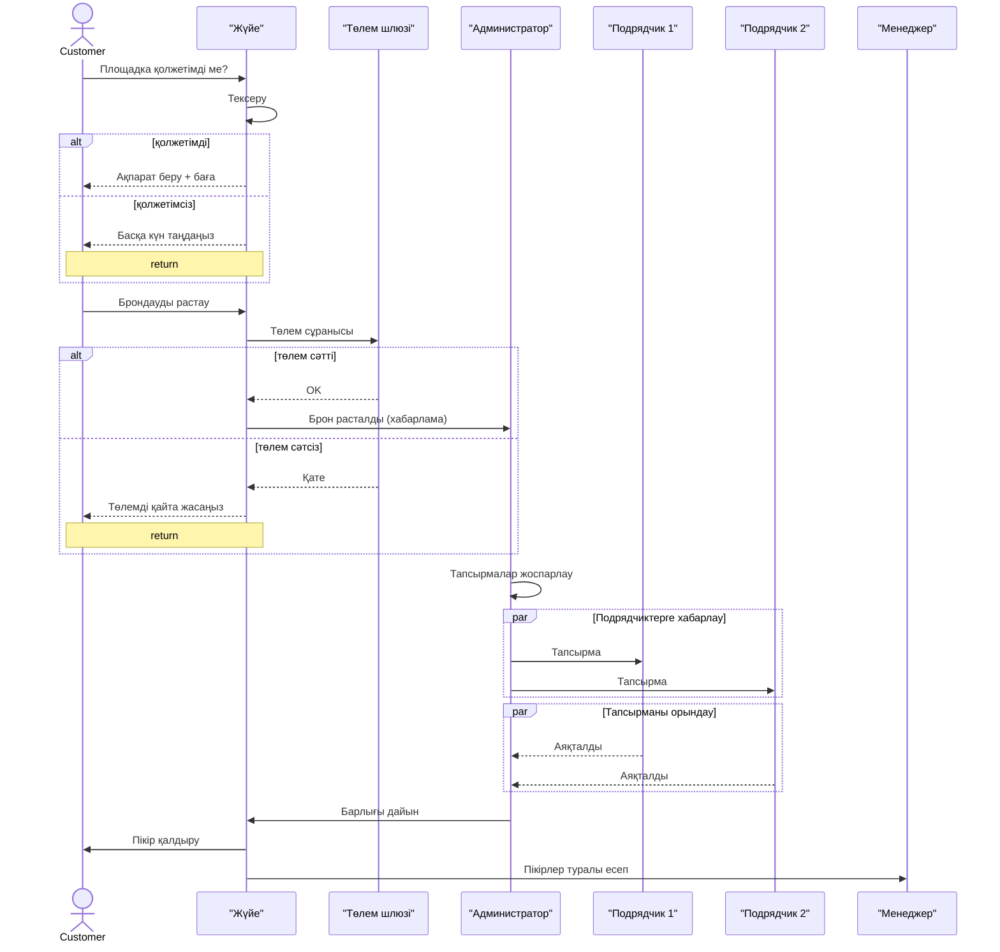

```mermaid
sequenceDiagram
    actor C as Customer
    participant S as "Жүйе"
    participant PG as "Төлем шлюзі"
    participant A as "Администратор"
    participant P1 as "Подрядчик 1"
    participant P2 as "Подрядчик 2"
    participant M as "Менеджер"

    %% Брондау запросы
    C->>S: Площадка қолжетімді ме?
    S->>S: Тексеру
    alt қолжетімді
        S-->>C: Ақпарат беру + баға
    else қолжетімсіз
        S-->>C: Басқа күн таңдаңыз
        Note over C,S: return
    end

    %% Төлем
    C->>S: Брондауды растау
    S->>PG: Төлем сұранысы
    alt төлем сәтті
        PG-->>S: OK
        S->>A: Брон расталды (хабарлама)
    else төлем сәтсіз
        PG-->>S: Қате
        S-->>C: Төлемді қайта жасаңыз
        Note over C,S: return
    end

    %% Ұйымдастыру
    A->>A: Тапсырмалар жоспарлау
    par Подрядчиктерге хабарлау
        A->>P1: Тапсырма
        A->>P2: Тапсырма
    end
    par Тапсырманы орындау
        P1-->>A: Аяқталды
        P2-->>A: Аяқталды
    end
    A->>S: Барлығы дайын

    %% Мероприятие аяқталуы
    S->>C: Пікір қалдыру
    S->>M: Пікірлер туралы есеп

```
