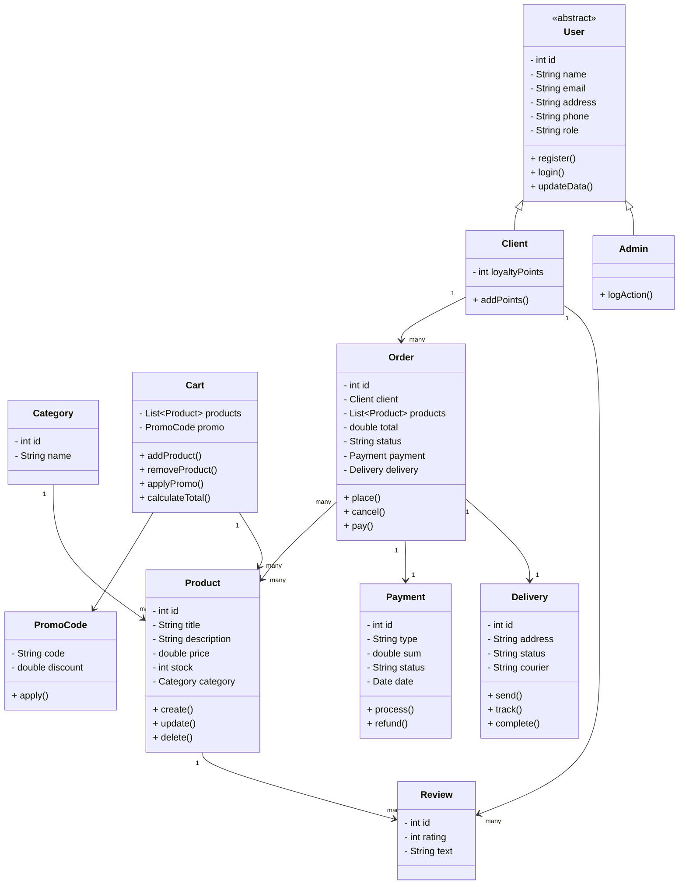

```mermaid
classDiagram
    class User {
        <<abstract>>
        - int id
        - String name
        - String email
        - String address
        - String phone
        - String role
        + register()
        + login()
        + updateData()
    }

    class Client {
        - int loyaltyPoints
        + addPoints()
    }

    class Admin {
        + logAction()
    }

    User <|-- Client
    User <|-- Admin

    class Category {
        - int id
        - String name
    }

    class Product {
        - int id
        - String title
        - String description
        - double price
        - int stock
        - Category category
        + create()
        + update()
        + delete()
    }

    Category "1" --> "many" Product

    class PromoCode {
        - String code
        - double discount
        + apply()
    }

    class Cart {
        - List~Product~ products
        - PromoCode promo
        + addProduct()
        + removeProduct()
        + applyPromo()
        + calculateTotal()
    }

    Cart --> PromoCode
    Cart "1" --> "many" Product

    class Payment {
        - int id
        - String type
        - double sum
        - String status
        - Date date
        + process()
        + refund()
    }

    class Delivery {
        - int id
        - String address
        - String status
        - String courier
        + send()
        + track()
        + complete()
    }

    class Order {
        - int id
        - Client client
        - List~Product~ products
        - double total
        - String status
        - Payment payment
        - Delivery delivery
        + place()
        + cancel()
        + pay()
    }

    Client "1" --> "many" Order
    Order "many" --> "many" Product
    Order "1" --> "1" Payment
    Order "1" --> "1" Delivery

    class Review {
        - int id
        - int rating
        - String text
    }

    Client "1" --> "many" Review
    Product "1" --> "many" Review

```
