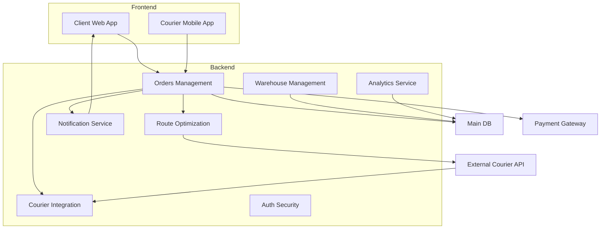

```mermaid
graph TD
    %% Frontend
    subgraph Frontend
        ClientWeb["Client Web App"]
        CourierMobile["Courier Mobile App"]
    end

    %% Backend
    subgraph Backend
        OrdersManagement["Orders Management"]
        WarehouseManagement["Warehouse Management"]
        RouteOptimization["Route Optimization"]
        CourierIntegration["Courier Integration"]
        NotificationService["Notification Service"]
        AnalyticsService["Analytics Service"]
        AuthSecurity["Auth Security"]
    end

    %% Database and external actors
    DB["Main DB"]
    CourierAPI["External Courier API"]
    PaymentAPI["Payment Gateway"]

    %% Connections
    ClientWeb --> OrdersManagement
    CourierMobile --> OrdersManagement

    OrdersManagement --> DB
    WarehouseManagement --> DB

    OrdersManagement --> RouteOptimization
    RouteOptimization --> CourierAPI

    OrdersManagement --> CourierIntegration
    CourierAPI --> CourierIntegration

    OrdersManagement --> NotificationService
    NotificationService --> ClientWeb

    AnalyticsService --> DB
    OrdersManagement --> PaymentAPI

```
