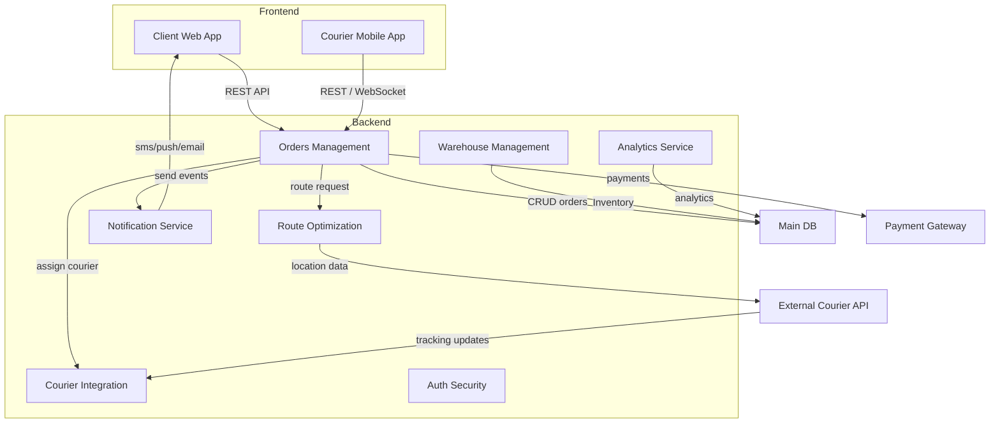

```mermaid
graph TD
    subgraph Frontend
        ClientWeb[Client Web App]
        CourierMobile[Courier Mobile App]
    end

    subgraph Backend
        OrdersManagement[Orders Management]
        WarehouseManagement[Warehouse Management]
        RouteOptimization[Route Optimization]
        CourierIntegration[Courier Integration]
        NotificationService[Notification Service]
        AnalyticsService[Analytics Service]
        AuthSecurity[Auth Security]
    end

    DB[Main DB]
    CourierAPI["External Courier API"]
    PaymentAPI["Payment Gateway"]

    ClientWeb -->|"REST API"| OrdersManagement
    CourierMobile -->|"REST / WebSocket"| OrdersManagement

    OrdersManagement -->|"CRUD orders"| DB
    WarehouseManagement -->|"Inventory"| DB

    OrdersManagement -->|"route request"| RouteOptimization
    RouteOptimization -->|"location data"| CourierAPI

    OrdersManagement -->|"assign courier"| CourierIntegration
    CourierAPI -->|"tracking updates"| CourierIntegration

    OrdersManagement -->|"send events"| NotificationService
    NotificationService -->|"sms/push/email"| ClientWeb

    AnalyticsService -->|"analytics"| DB
    OrdersManagement -->|"payments"| PaymentAPI

```
